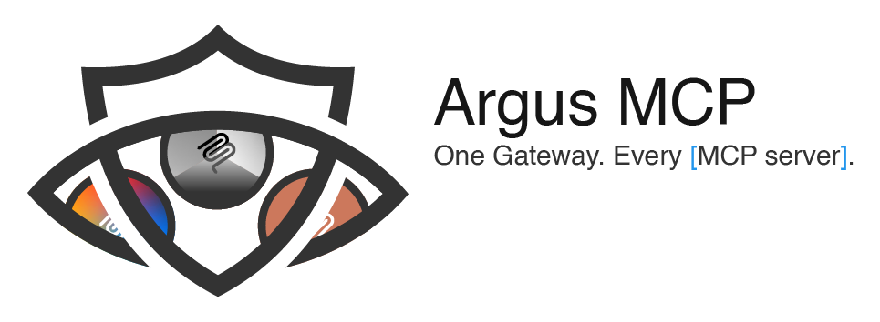
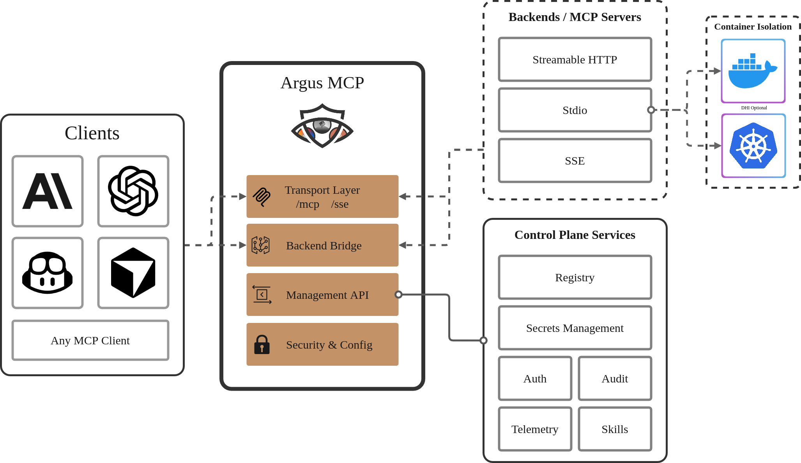
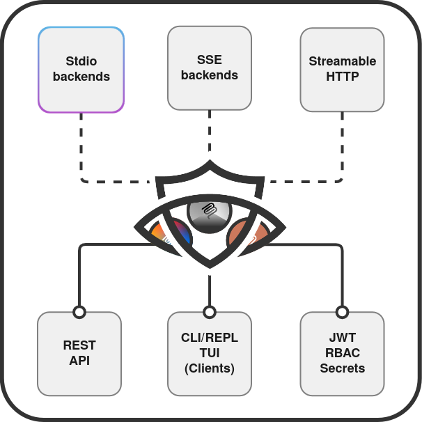

<!-- markdownlint-disable first-line-heading no-inline-html no-emphasis-as-heading -->
<picture>
  
</picture>

[][pypi]
[][pypi]
[][pypi]
[![PyPI version][pypi-img]][pypi]
[![Docker Hub pulls][docker-img]][docker]
[![GHCR][ghcr-img]][ghcr] [![License: GPL-3.0][license-img]][license]
[![Build status][ci-img]][ci]
[](https://github.com/diaz3618/argus-mcp/actions/workflows/semgrep.yml)

# Argus MCP - a single gateway guarding your MCP servers

**Connect any MCP client to all your MCP servers through a single server.**

Argus MCP is a central gateway and management platform for the [Model Context Protocol](https://modelcontextprotocol.io). Rather than configure each AI client to talk to each MCP server individually, point your clients at Argus and let it handle the rest - aggregating capabilities, routing tool calls, managing connections, and securing everything behind one endpoint.

<picture>
  
</picture>

---

<table>
<tr>
<td width="50%">

## What can Argus MCP offer?

- **One endpoint, many backends:** MCP clients connect to one Argus address - Argus aggregates tools, resources, and prompts from all your backend servers.
- **Stdio isolation:** Run stdio MCP servers in isolated Docker containers, or deploy them on Kubernetes.
- **Any transport:** Backends can be local stdio processes, remote SSE endpoints, or Streamable HTTP servers. Argus works with all three.
- **Secure by default:** JWT/OIDC authentication, RBAC authorization, encrypted secret storage, and automatic log redaction.
- **Live management:** Hot-reload config, reconnect backends, and monitor everything through the REST API, TUI, or CLI/REPL.
- **Runs anywhere:** Install from PyPI, run in Docker, or build from source.

<br>
</td>
<td width="50%" align="center">
  <picture>
    
  </picture>
</td>
</tr>
</table>

## Components

Argus MCP has a server/client architecture:

| Command | Description |
|---------|-------------|
| `argus-mcp server` | Headless server — runs the MCP bridge, management API, and transports |
| `argus-mcp build` | Pre-build container images for stdio backends |
| `argus-mcp stop` | Stop a detached Argus server |
| `argus-mcp status` | List all running Argus server sessions |
| `argus-mcp tui` | Textual-based terminal UI that connects to a running server over HTTP |
| `argus-mcp secret` | Manage encrypted secrets (set, get, list, delete) |
| `argus-mcp clean` | Remove containers and images created by Argus MCP |

**Companion packages:**

| Package | Entry Point | Description |
|---------|-------------|-------------|
| `argus-cli` | `argus` | Client CLI with 20 command groups and an interactive REPL for managing a running server |
| `argus-cli` | `argus-tui` | Alternative TUI launcher from the client package |
| `argusd` | `argusd` | Go sidecar daemon for Docker container and Kubernetes pod management (Unix Domain Socket API) |

---

## Links

- [Getting started](docs/getting-started.md)
- [Configuration reference](docs/configuration.md)
- [Management API](docs/api/endpoints.md)
- [Docker guide](docs/docker.md)
- [Kubernetes guide](docs/kubernetes.md)
- [Security guide](docs/security-guide.md)
- [CLI reference](docs/cli/README.md)
- [TUI guide](docs/tui/README.md)
- [Changelog](https://github.com/diaz3618/argus-mcp/releases)
- [Report an issue](https://github.com/diaz3618/argus-mcp/issues)

---

## How it works

1. **Configure** backends in a YAML file — stdio processes, SSE servers, or HTTP endpoints.
2. **Start** with `argus-mcp server` — Argus connects to all backends and aggregates their capabilities.
3. **Point** any MCP client (Claude Desktop, Cursor, Copilot, Cline, etc.) at the Argus endpoint.
4. **Monitor** via the TUI, REST API, or hot-reload config without restarting.

Argus exposes two transports simultaneously:

| Transport | Endpoint |
|-----------|----------|
| SSE | `http://<host>:<port>/sse` |
| Streamable HTTP | `http://<host>:<port>/mcp` |

---

## Installation

**Docker** (recommended — no Python required):

```bash
docker run --rm -p 9000:9000 diaz3618/argus-mcp:latest server --host 0.0.0.0
```

Published to [Docker Hub](https://hub.docker.com/r/diaz3618/argus-mcp) and [GHCR](https://ghcr.io/diaz3618/argus-mcp) with multi-arch support (amd64 + arm64). See the [Docker guide](docs/docker.md) for Compose files and volume mounts.

**PyPI** (requires Python 3.10+):

```bash
uv tool install argus-mcp   # recommended
pipx install argus-mcp      # alternative
```

> **Try without installing:** `uv run argus-mcp --help`

See [getting started](docs/getting-started.md) for source installation and Makefile shortcuts.

---

## Quick start

```bash
# Start the server (auto-detects config.yaml)
argus-mcp server

# Detached mode
argus-mcp server --detach --name my-server
argus-mcp status
argus-mcp stop my-server
```

Config file resolution: `--config` flag → `ARGUS_CONFIG` env → auto-detect (`config.yaml` → `config.yml`).

See the [getting started guide](docs/getting-started.md) for a full walkthrough.

---

## Configuration

A minimal config to get started:

```yaml
version: "1"

backends:
  filesystem:
    type: stdio
    command: npx
    args: ["-y", "@modelcontextprotocol/server-filesystem", "/tmp"]

  remote_tools:
    type: sse
    url: "https://mcp.example.com/sse"
```

Backends can be `stdio` (local process), `sse`, or `streamable-http`. All string values support `${VAR_NAME}` env expansion and `secret:name` references to the encrypted secret store.

See the [configuration reference](docs/configuration.md) for all fields, backend types, auth options, RBAC policies, and feature flags.

---

## Management API

A REST API at `/manage/v1/` provides full runtime control: health/readiness probes, backend reconnection, hot-reload, live event streaming, capability proxying, and more.

Set `ARGUS_MGMT_TOKEN` to require `Authorization: Bearer <token>` on all management requests.

See the [API reference](docs/api/endpoints.md) for the full endpoint list.

---

## TUI

```bash
argus-mcp tui --server http://127.0.0.1:9000
```

The TUI supports multi-server mode via a `servers.json` config — switch between servers from a single dashboard. See the [TUI guide](docs/tui/README.md) for details.

---

## Contributing

- [Report issues](https://github.com/diaz3618/argus-mcp/issues)
- [Pull requests](https://github.com/diaz3618/argus-mcp/pulls)

---

## License

This project is licensed under the [GNU General Public License v3.0](LICENSE).

<!-- Badge links -->
[pypi-img]: https://img.shields.io/pypi/v/argus-mcp?style=flat&logo=pypi&logoColor=white&label=PyPI
[pypi]: https://pypi.org/project/argus-mcp/
[ci-img]: https://img.shields.io/github/actions/workflow/status/diaz3618/argus-mcp/ci.yml?style=flat&logo=github&label=CI
[ci]: https://github.com/diaz3618/argus-mcp/actions/workflows/ci.yml
[docker-img]: https://img.shields.io/docker/pulls/diaz3618/argus-mcp?style=flat&logo=docker&label=Docker%20Hub
[docker]: https://hub.docker.com/r/diaz3618/argus-mcp
[ghcr-img]: https://img.shields.io/badge/GHCR-available-blue?style=flat&logo=github
[ghcr]: https://ghcr.io/diaz3618/argus-mcp
[license-img]: https://img.shields.io/badge/License-GPL--3.0-blue?style=flat
[license]: https://opensource.org/licenses/GPL-3.0
