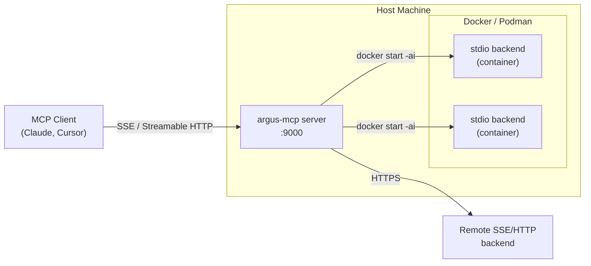
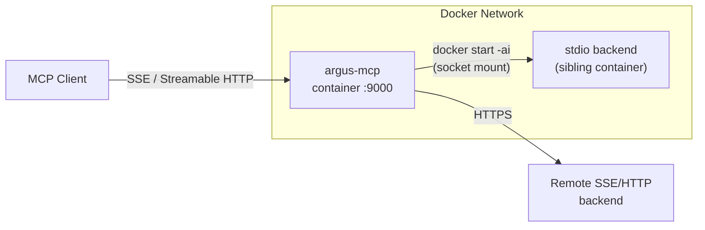
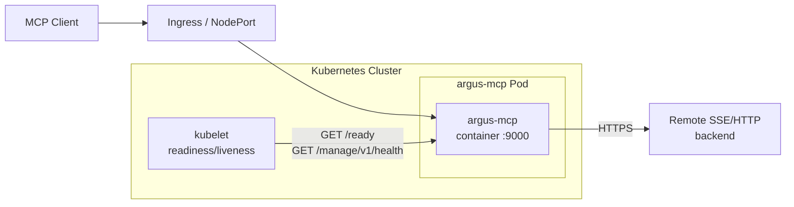

# Architecture Overview

Argus MCP sits between MCP clients (LLMs, IDEs, agents) and multiple backend
MCP servers. It aggregates capabilities, enforces security policies, and provides
operational visibility — all through a single connection point.

## System Diagram

```
                     ┌──────────────────────────────────────────┐
                     │              Argus MCP                   │
                     │                                          │
  MCP Clients        │  ┌─────────┐   ┌───────────────────┐     │
  ─────────────────► │  │Transport│──►│  Middleware Chain │     │
  (Claude, Cursor,   │  │ Layer   │   │                   │     │      Backend MCP Servers
   VS Code, etc.)    │  │         │   │  Auth             │     │
                     │  │ SSE     │   │  AuthZ            │     │      ┌───────────────────┐
  ◄───────────────── │  │         │   │  Telemetry        │     │  ┌──►│ stdio (container) │
  Aggregated tools,  │  │ Stream- │   │  Audit            │     │  │   └───────────────────┘
  resources, prompts │  │ able    │   │  Recovery         │     │  │   ┌─────────────┐
                     │  │ HTTP    │   │  Routing ─────────┼─────┼──┼──►│ SSE server  │
                     │  └─────────┘   └───────────────────┘     │  │   └─────────────┘
                     │                                          │  │   ┌─────────────┐
                     │  ┌──────────────┐  ┌──────────────────┐  │  └──►│ HTTP server │
                     │  │ Management   │  │ Bridge           │  │      └─────────────┘
                     │  │ API          │  │                  │  │
                     │  │ /manage/v1/  │  │ Registry         │  │
                     │  │              │  │ ClientManager    │  │
                     │  │ Health       │  │ StartupCoord     │  │
                     │  │ Status       │  │ Optimizer        │  │
                     │  │ Backends     │  │ ConflictResolver │  │
                     │  │ Events       │  │ Filters          │  │
                     │  │ Hot-reload   │  │ GroupManager     │  │
                     │  └──────────────┘  │ ContainerWrapper │  │
                     │                    └──────────────────┘  │
                     │                                          │
                     │  ┌──────────┐ ┌────────┐  ┌───────────┐  │
                     │  │ Secrets  │ │ Audit  │  │ Telemetry │  │
                     │  │ Store    │ │ Logger │  │ OTel      │  │
                     │  └──────────┘ └────────┘  └───────────┘  │
                     └──────────────────────────────────────────┘
                                         ▲
                                         │ HTTP polling / UDS
                                   ┌─────┴─────┐
                                   │  argus    │
                                   │  CLI/TUI  │
                                   │  (client) │
                                   └─────┬─────┘
                                         │ UDS
                                   ┌─────┴─────┐
                                   │  argusd   │
                                   │  (daemon) │
                                   └─────┬─────┘
                                         │
                              ┌──────────┴──────────┐
                              │ Docker / Kubernetes │
                              └─────────────────────┘
```

## Package Structure

```
argus_mcp/
├── __init__.py
├── __main__.py          # python -m argus_mcp
├── cli/                 # CLI subcommands
│   ├── __init__.py      # Entry point: argparse dispatch
│   ├── _server.py       # argus-mcp server
│   ├── _build.py        # argus-mcp build
│   ├── _stop.py         # argus-mcp stop
│   ├── _tui.py          # argus-mcp tui
│   ├── _secret.py       # argus-mcp secret
│   ├── _clean.py        # argus-mcp clean
│   └── _common.py       # Shared CLI utilities
├── constants.py         # Shared constants
├── errors.py            # Base exception hierarchy
├── _error_utils.py      # Error formatting helpers
├── _task_utils.py       # Asyncio task utilities
├── sessions.py          # Named detached-session registry (stop/status)
│
├── config/              # Configuration system
│   ├── loader.py        # JSON/YAML loading, validation (Rust-accelerated YAML)
│   ├── _yaml_rs/        # Rust crate: serde_yaml-based YAML parser (PyO3)
│   ├── schema.py        # Top-level ArgusConfig Pydantic model
│   ├── schema_backends.py  # Backend config models (stdio, SSE, streamable-http)
│   ├── schema_client.py    # Client/TUI config models
│   ├── schema_registry.py  # Registry config models
│   ├── schema_security.py  # Auth, authz, secrets config models
│   ├── schema_server.py    # Server & management config models
│   ├── migration.py     # Legacy → v1 auto-migration
│   ├── diff.py          # Config change detection
│   ├── flags.py         # FeatureFlags
│   ├── watcher.py       # File watcher for hot-reload
│   └── client_gen.py    # Client config generation
│
├── server/              # ASGI server & MCP protocol
│   ├── app.py           # Starlette app + route setup
│   ├── lifespan.py      # Startup/shutdown lifecycle
│   ├── handlers.py      # MCP protocol handlers
│   ├── transport.py     # SSE + Streamable HTTP transports
│   ├── origin.py        # Origin validation middleware (MCP spec)
│   ├── state.py         # Server state management
│   ├── auth/            # Incoming authentication (JWT, OIDC, local)
│   ├── authz/           # RBAC authorization (engine + policies)
│   ├── session/         # Client session tracking (manager + models)
│   └── management/      # REST management API (router, schemas, auth)
│
├── bridge/              # Backend connectivity layer
│   ├── client_manager.py       # Backend connections lifecycle
│   ├── capability_registry.py  # Capability aggregation
│   ├── backend_connection.py   # Backend connection helpers
│   ├── startup_coordinator.py  # Startup orchestration & ordering
│   ├── auth_discovery.py       # Non-blocking OAuth/OIDC auth discovery
│   ├── transport_factory.py    # Transport creation factory
│   ├── subprocess_utils.py     # Subprocess management utilities
│   ├── conflict.py      # Conflict resolution
│   ├── filter.py        # Capability filtering
│   ├── rename.py        # Tool renaming
│   ├── groups.py        # Logical server groups
│   ├── elicitation.py   # MCP elicitation support
│   ├── version_checker.py  # Version drift detection
│   ├── auth/            # Outgoing authentication
│   │   ├── discovery.py     # OAuth/OIDC metadata discovery (RFC 9728)
│   │   ├── pkce.py          # PKCE browser-based auth flow
│   │   ├── provider.py      # Auth provider factory
│   │   ├── store.py         # Token/credential storage
│   │   └── token_cache.py   # Token caching and refresh
│   ├── container/       # Container isolation for stdio backends
│   │   ├── wrapper.py       # Main entry point — wrap_backend()
│   │   ├── image_builder.py # Docker image build orchestration
│   │   ├── runtime.py       # Container runtime detection (Docker/Podman)
│   │   ├── network.py       # Network mode resolution
│   │   ├── labels.py        # OCI/Docker container labels
│   │   ├── go_docker_adapter.py  # Go binary Docker adapter
│   │   └── templates/       # Jinja2 Dockerfile templates
│   │       ├── models.py        # TemplateData, RuntimeConfig, UID constants
│   │       ├── engine.py        # Template rendering engine
│   │       ├── _generators.py   # Per-transport build logic
│   │       ├── validation.py    # Template output validation
│   │       ├── uvx.dockerfile.j2     # Python/uvx backend Dockerfile
│   │       ├── npx.dockerfile.j2     # Node.js/npx backend Dockerfile
│   │       ├── go.dockerfile.j2      # Go binary backend Dockerfile
│   │       └── source.dockerfile.j2  # Source-build backend Dockerfile
│   ├── health/          # Health checking (checker + circuit breaker)
│   ├── middleware/       # Request middleware chain
│   └── optimizer/       # Tool optimizer (meta-tools + search index)
│
├── runtime/             # Service lifecycle
│   ├── service.py       # ArgusService orchestration
│   └── models.py        # Runtime status models
│
├── audit/               # Audit logging
│   ├── models.py        # AuditEvent (NIST SP 800-53)
│   ├── logger.py        # JSONL writer with rotation (Rust-accelerated serialization)
│   └── _audit_rs/       # Rust crate: serde_json audit event serializer (PyO3)
│
├── secrets/             # Secret management
│   ├── store.py         # SecretStore facade
│   ├── providers.py     # Env, File, Keyring providers
│   └── resolver.py      # Config secret:name resolution
├── skills/              # Skill packs
│   ├── manifest.py      # SkillManifest model
│   └── manager.py       # Install, enable, discover
│
├── workflows/           # Composite workflows
│   ├── dsl.py           # Workflow step definitions
│   ├── executor.py      # Step execution engine
│   └── composite_tool.py # Workflow-as-tool wrapper
│
├── telemetry/           # OpenTelemetry integration
│   ├── config.py        # Telemetry configuration
│   ├── metrics.py       # Counters, histograms
│   └── tracing.py       # Span management
│
├── registry/            # Server registry
│   ├── client.py        # Registry client
│   ├── cache.py         # Registry cache
│   └── models.py        # Registry data models
│
├── display/             # Console output (headless mode)
│   ├── installer.py     # Backend startup progress display (Rich Live)
│   ├── console.py       # General status display
│   └── logging_config.py # File logging + secret redaction
│
└── tui/                 # Terminal UI (Textual)
    ├── app.py           # ArgusApp
    ├── api_client.py    # HTTP client for management API
    ├── server_manager.py # Multi-server connections
    ├── events.py        # Custom Textual messages
    ├── settings.py      # TUI preferences
    ├── _constants.py    # Phase/icon/badge constants
    ├── argus.tcss       # Stylesheet
    ├── screens/         # Dashboard, Tools, Registry, Settings, ...
    └── widgets/         # Reusable UI components
```

### Packages (client ecosystem)

The `packages/` directory holds standalone companion packages that
communicate with the Argus MCP server over HTTP and with the argusd
daemon over a Unix Domain Socket.

```
packages/
├── argus_cli/                   # argus-cli — interactive client (MIT)
│   ├── pyproject.toml           # Hatchling build, v0.1.0
│   └── argus_cli/
│       ├── main.py              # Typer app root — entry point "argus"
│       ├── client.py            # httpx client for management API
│       ├── config.py            # CLI configuration (CliConfig)
│       ├── output.py            # Output formatting (rich, json, table, text)
│       ├── theme.py             # Theme loading and management
│       ├── design.py            # Unified design system (status dots, phase icons)
│       ├── daemon_client.py     # Async client for argusd over UDS
│       │
│       ├── commands/            # Typer command groups (20 groups)
│       │   ├── audit.py         # Audit log queries
│       │   ├── auth.py          # Authentication management
│       │   ├── backends.py      # Backend lifecycle (list, inspect, reconnect)
│       │   ├── batch.py         # Bulk operations
│       │   ├── config_cmd.py    # Configuration display and reload
│       │   ├── config_server.py # Server-side config management
│       │   ├── containers.py    # Docker container management (via argusd)
│       │   ├── events.py        # Event stream queries
│       │   ├── health.py        # Health and session status
│       │   ├── operations.py    # Optimizer and telemetry controls
│       │   ├── pods.py          # Kubernetes pod management (via argusd)
│       │   ├── prompts.py       # MCP prompts (list, get)
│       │   ├── registry.py      # Server registry (search, install)
│       │   ├── resources.py     # MCP resources (list, read)
│       │   ├── secrets.py       # Secrets management
│       │   ├── server.py        # Server lifecycle (start, stop, status)
│       │   ├── skills.py        # Skill pack management
│       │   ├── tools.py         # MCP tools (list, inspect, call)
│       │   └── workflows.py     # Workflow management
│       │
│       ├── repl/                # Interactive REPL (prompt-toolkit)
│       │   ├── loop.py          # Main REPL loop and input handling
│       │   ├── completions.py   # Dynamic tab completions from API
│       │   ├── dispatch.py      # Command routing (Typer or REPL handler)
│       │   ├── handlers.py      # REPL-only commands (use, alias, watch, etc.)
│       │   ├── state.py         # Session state (connection, aliases, history)
│       │   └── toolbar.py       # Status bar prompt and toolbar
│       │
│       ├── themes/              # 16 YAML color palettes
│       │   ├── catppuccin-{frappe,latte,macchiato,mocha}.yaml
│       │   ├── dracula.yaml, everforest.yaml, gruvbox.yaml
│       │   ├── kanagawa.yaml, monokai.yaml, nord.yaml
│       │   ├── one-dark.yaml, rose-pine.yaml, rose-pine-moon.yaml
│       │   ├── solarized-{dark,light}.yaml, tokyo-night.yaml
│       │
│       ├── widgets/             # Rich CLI widgets
│       │   ├── banner.py        # Startup banner
│       │   ├── panels.py        # Reusable Rich panels
│       │   ├── spinners.py      # Progress spinners
│       │   └── tables.py        # Formatted Rich tables
│       │
│       └── tui/                 # Terminal UI (Textual) — enhanced
│           ├── app.py           # ArgusApp (modes, keybindings, polling)
│           ├── api_client.py    # HTTP client for management API
│           ├── server_manager.py # Multi-server connections
│           ├── screens/         # 20+ screens (see TUI docs)
│           └── widgets/         # 35+ widgets (see TUI docs)
│
└── argusd/                      # argusd — Go sidecar daemon
    ├── go.mod
    ├── Makefile
    ├── cmd/argusd/main.go       # Entry point — UDS HTTP server
    └── internal/
        ├── docker/client.go     # Docker Engine API client
        ├── k8s/client.go        # Kubernetes API client (optional)
        ├── labels/labels.go     # Argus resource labeling conventions
        └── server/
            ├── router.go        # HTTP route registration
            ├── handlers.go      # Request handlers
            └── sse.go           # Server-Sent Events streaming
```

## Data Flow

### 1. Startup

```
CLI (main)
  → Uvicorn
    → Starlette app_lifespan
      → Load & validate config (JSON/YAML)
      → Resolve secrets (secret:name → values)
      → Create ArgusService
        → StartupCoordinator: sort backends (remotes first, then stdio)
          → Phase 1: launch_remote_tasks()
            → Concurrent (semaphore-gated, stagger 0.5s)
            → For each SSE/HTTP backend:
              → Auth discovery (RFC 9728): non-blocking, PKCE 630s timeout
              → Connect transport
          → Phase 2: build_and_connect_stdio()
            → For each stdio backend:
              → Container wrapper: detect runtime, build image, pre-create container
              → Wrap params: command becomes "docker start -ai <container_id>"
          → Phase 3: gather_remote_results()
            → Await remote tasks, collect pass/fail
        → CapabilityRegistry: discover & aggregate capabilities
        → Apply conflict resolution, filters, renames
        → Build middleware chain
        → Start AuditLogger, SessionManager, HealthChecker
      → Attach to MCP server instance
      → Start management API
```

### 2. MCP Request

```
Client request (list_tools / call_tool / read_resource / get_prompt)
  → Transport layer (SSE or Streamable HTTP)
    → MCP protocol handler
      → Middleware chain:
        1. AuthMiddleware      — validate bearer token, extract identity
        2. AuthzMiddleware     — check RBAC policies
        3. TelemetryMiddleware — create OTel span, record metrics
        4. AuditMiddleware     — log structured audit event
        5. RecoveryMiddleware  — catch exceptions, return clean errors
        6. RoutingMiddleware   — resolve backend, forward request
      → Backend MCP session
    → Response back through chain
  → Client receives result
```

### 3. Management API Request

```
HTTP request → /manage/v1/{endpoint}
  → BearerAuthMiddleware (token check, /health exempt)
    → Route handler
      → Read from ArgusService state
    → JSON response
```

### 4. TUI Polling

```
ArgusApp (Textual)
  → ApiClient polls /manage/v1/ endpoints every 2s
    → Health, Backends, Capabilities, Events
  → Updates widgets with fresh data
  → Handles connection loss/restore gracefully
```

### 5. REPL Session

```
argus (no subcommand)
  → start_repl()
    → Connect to server (management API health check)
    → Populate dynamic completions (backends, tools, resources, prompts)
    → prompt-toolkit session with history, auto-suggest, toolbar
    → User input
      → REPL-only command (use, alias, watch, connect, set, clear, help)?
          → Handle directly
      → Typer command (backends list, tools call ...)?
          → dispatch_command() → Typer CLI invoke
    → Loop until exit/quit
```

### 6. argusd (Daemon)

```
argusd [-socket /path/to/argusd.sock]
  → Initialize Docker client (required)
  → Initialize Kubernetes client (optional)
  → HTTP server on Unix Domain Socket
    → /v1/health              GET   — Daemon health
    → /v1/containers          GET   — List containers (Argus-labeled)
    → /v1/containers/{id}     GET   — Inspect container
    → /v1/containers/{id}/*   POST  — Start / stop / restart / remove
    → /v1/containers/{id}/logs  GET — Stream container logs (SSE)
    → /v1/containers/{id}/stats GET — Stream container stats (SSE)
    → /v1/events              GET   — Docker event stream (SSE)
    → /v1/pods                GET   — List pods (if K8s available)
    → /v1/pods/{ns}/{name}/*  GET/DELETE — Describe, logs, events, delete
    → /v1/deployments/{ns}/{name}/restart POST — Rollout restart
  ← DaemonClient (argus_cli) connects via httpx UDS transport
```

## Deployment Modes

Argus MCP supports three deployment modes. Each mode determines how the gateway
process runs and how backends connect.

### stdio subprocess (default for local development)



Run with `argus-mcp server`. stdio backends are wrapped in hardened containers
(non-root, read-only filesystem, no network by default). Remote SSE and
Streamable HTTP backends connect over HTTPS.

### Docker



Run with `docker run`. Mount the Docker socket to allow Argus to manage
sibling containers for stdio backends. See [Docker usage](../docker.md).

### Kubernetes



Deploy with the Helm chart in `charts/argus-mcp/`. The gateway connects to
remote backends only (no stdio in-cluster). Probes use `/ready` (readiness)
and `/manage/v1/health` (liveness). See [Kubernetes deployment](../kubernetes.md).

## Rust Acceleration Layer

Performance-critical paths use optional Rust extensions built with
[PyO3](https://pyo3.rs/) and [maturin](https://maturin.rs/). Every Rust
crate ships with an `abi3-py311` stable ABI wheel and falls back to a
pure-Python implementation when the native extension is unavailable.

```
argus_mcp/
├── config/
│   └── _yaml_rs/           # YAML → Python dict (serde_yaml → json.loads)
├── audit/
│   └── _audit_rs/           # Audit event JSON serialization (serde_json)
├── plugins/
│   ├── _filter_rs/          # PII / secrets regex scanning
│   ├── _hash_rs/            # JSON + SHA-256 cache key generation
│   └── builtins/
│       └── _circuit_breaker_rs/  # Circuit breaker state machine
├── bridge/
│   └── auth/
│       └── _token_cache_rs/     # Token cache with TTL
```

### Fallback Pattern

Each module uses a try/except import guard so the gateway works with or
without compiled extensions:

```python
try:
    from yaml_rs import parse_yaml as _rust_parse_yaml
    _USE_RUST_YAML = True
except ImportError:
    _USE_RUST_YAML = False
```

Call sites branch on the flag:

```python
if _USE_RUST_YAML:
    data = _rust_parse_yaml(text)
else:
    data = yaml.safe_load(text)
```

### Benchmark Summary

| Module              | Python p50 (µs) | Rust p50 (µs) | Speedup    |
|---------------------|------------------|---------------|------------|
| YAML config parsing | 1037             | 25            | **41.9×**  |
| Audit serialization | 8.2              | 7.7           | 1.1×       |
| Cache key hashing   | 8.2              | 10.2          | 0.8×       |

YAML parsing shows the largest gain because it replaces Python's pure-Python
YAML parser with Rust's `serde_yaml` + `serde_json` pipeline.  Sub-10 µs
operations like hashing and audit serialization are dominated by FFI
crossing overhead.

### Building the Extensions

```bash
# Build all Rust crates in release mode
cd argus_mcp/config/_yaml_rs && maturin develop --release
cd argus_mcp/audit/_audit_rs && maturin develop --release
cd argus_mcp/plugins/_hash_rs && maturin develop --release
```

Each crate's `Cargo.toml` enables LTO (`lto = "fat"`) and
`codegen-units = 1` for maximum optimization.

## Design Principles

| Principle | Implementation |
|-----------|----------------|
| **Single connection point** | Clients connect once; Argus routes to N backends |
| **Protocol-native** | Speaks MCP natively — no protocol translation |
| **Transport-agnostic** | Supports stdio, SSE, and Streamable HTTP backends |
| **Container-first isolation** | stdio backends run in hardened containers by default |
| **Middleware pipeline** | Pluggable chain for cross-cutting concerns |
| **Config-driven** | All behavior controlled via YAML config |
| **Defense in depth** | Auth → AuthZ → Audit → Recovery → Container isolation |
| **Graceful degradation** | Backend failures don't crash the gateway |
| **Operational visibility** | Management API + TUI + audit logs + health checks |
| **Optional native acceleration** | Rust extensions for hot paths, pure-Python fallback always available |
